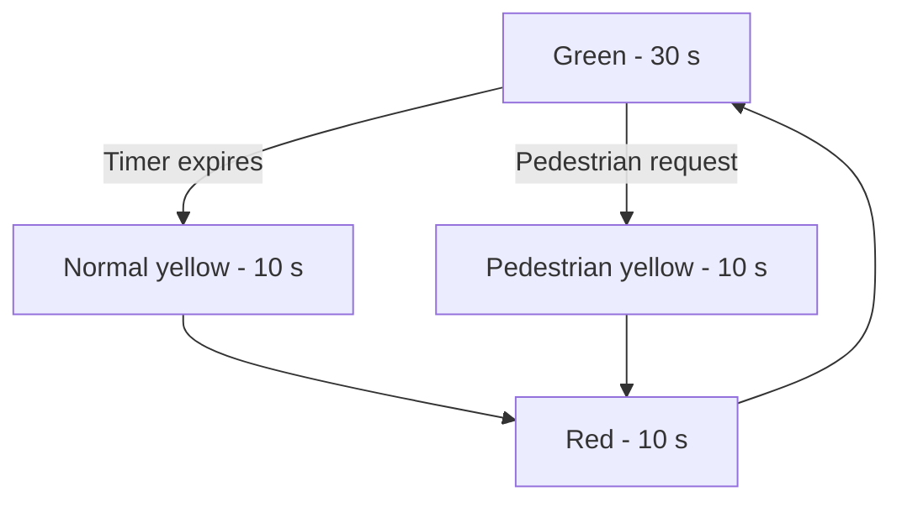

# Interrupt-Driven Traffic Light Controller

An ARM assembly traffic-light controller for the **TM4C123GH6PM Cortex-M4** microcontroller. The project uses a finite-state machine (FSM), a 1-second SysTick interrupt, and an edge-triggered pedestrian button interrupt to control traffic LEDs and a seven-segment countdown display.

Demo found: [HERE](https://www.youtube.com/watch?v=XJULkPF9oIQ)

## Features

- Normal traffic cycle with timed green, yellow, and red states
- Asynchronous pedestrian requests through a GPIO interrupt on PF4
- Flashing pedestrian-warning state with a seven-segment countdown
- Hardware-based 1-second timing using the Cortex-M SysTick timer
- Direct memory-mapped GPIO and NVIC register access
- Modular ARM assembly drivers for Ports B and F

## System Behavior

| State | Duration | Output | Next state |
|---|---:|---|---|
| Green | 30 seconds | Green LED on | Normal yellow, or pedestrian yellow when a request is pending |
| Normal yellow | 10 seconds | Yellow LED on | Red |
| Pedestrian yellow | 10 seconds | Yellow LED flashes while the display counts down | Red |
| Red | 10 seconds | Red LED on | Green |

The SysTick handler decrements a shared countdown once per second. The Port F handler sets a pedestrian-request flag and clears the GPIO interrupt. The main FSM polls these shared values to decide when to change states.

## Hardware

- TM4C123GH6PM-based development board
- Breadboard and jumper wires
- Three traffic-signal LEDs with current-limiting resistors
- One tactile push button with a pull-down configuration
- One single-digit seven-segment display with suitable resistors

### Pin Assignment

| Pin(s) | Direction | Purpose |
|---|---|---|
| PB0-PB7 | Output | Custom-mapped seven-segment display segments |
| PF1 | Output | Red traffic LED |
| PF2 | Output | Yellow traffic LED |
| PF3 | Output | Green traffic LED |
| PF4 | Input | Pedestrian push button; rising-edge interrupt |

> The firmware assumes a 16 MHz system clock. `SysTick_Init` receives a reload period of 16,000,000 cycles to generate the 1-second heartbeat.

## Project Structure

| File | Purpose |
|---|---|
| `Main.s` | Initializes the system, implements the FSM, stores the seven-segment lookup table, and defines the SysTick and GPIO handlers |
| `PortB_Driver` | Configures Port B and provides display input/output routines |
| `PortF_driver (1).s` | Configures PF1-PF3 as LED outputs and PF4 as an interrupt-driven button input |
| `SysTickInt.s` | Configures SysTick reload, priority, interrupt, and clock source |
| `Startup.s` | Supplies the vector table, reset handler, stack setup, and default interrupt handlers |
| `tm4c123gh6pm_constants.s` | Defines TM4C123 peripheral and Cortex-M register addresses |
| `Traffic Light Controller Report.pdf` | Project background, goals, and design summary |

## Software Design

### Finite-State Machine

The controller uses labeled assembly branches for deterministic transitions between `State_Green`, `State_Normal_Yellow`, `State_Ped_Yellow`, and `State_Red`. Each state loads `Time_Counter`, writes its GPIO output, and polls until a transition condition occurs.

### Interrupts

- **SysTick:** runs once per second and decrements `Time_Counter` until it reaches zero.
- **GPIO Port F:** detects a rising edge on PF4, sets `Pedestrian_Flag`, clears the interrupt source, and returns to the interrupted code.

### Seven-Segment Display

`SSD_Table` stores the custom Port B bit patterns for digits 0-9. During the pedestrian-yellow state, the current countdown value selects a pattern that is written to the display.

## Build and Run

1. Create a TM4C123GH6PM assembly project in **Keil uVision**.
2. Add all `.s` files and `PortB_Driver` to the project source group.
3. Ensure `tm4c123gh6pm_constants.s` is available in the assembler include path.
4. Select the correct TM4C123 target device and use `Startup.s` as the startup file.
5. Build the project and resolve any duplicate startup file automatically added by the IDE.
6. Connect the LEDs, push button, and seven-segment display according to the pin table.
7. Flash the program to the board and reset it. The controller begins in the green state.

## Concepts Demonstrated

- ARM Thumb assembly programming
- Finite-state machine design
- Interrupt service routines
- SysTick timer configuration
- GPIO and NVIC configuration
- Memory-mapped I/O
- Hardware/software integration

## Author

**Lance Farrell**  
Wayne State University - ECE 3620  
May 2026

